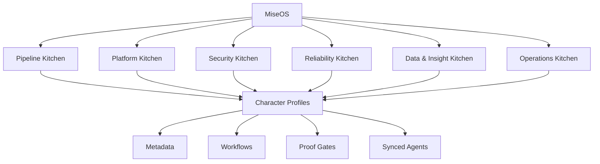

<div align="center">


# MiseOS Character Agent Registry

**Executable personalities for AI\-native software operations\.**

<p>
  
  
  
  
</p>

</div>

---

## Overview

MiseOS models software work as a coordinated kitchen of character agents\. Each character has a clickable visual identity, machine\-readable metadata, operational workflow, proof gate, statistics, department membership, and explicit handoffs to other agents\.

This profile contains all **112 character agents** in the supplied canonical ecosystem registry\. The source registry also contains **23 registry manifests**, giving **135 total ecosystem records**\.

---

## Architecture map



---

## Character roster

Every portrait is clickable and opens that character’s dedicated profile\.

### Pipeline Kitchen

<a href="./characters/alko-commit-chef/README.md"></a>
<a href="./characters/bruno-blast-radius/README.md"></a>
<a href="./characters/lila-branchkeeper/README.md"></a>
<a href="./characters/omar-reviewer/README.md"></a>
<a href="./characters/hugo-matrix/README.md"></a>
<a href="./characters/seira-scan/README.md"></a>
<a href="./characters/yume-builder/README.md"></a>
<a href="./characters/iron-hashi/README.md"></a>
<a href="./characters/nina-promoter/README.md"></a>
<a href="./characters/release-conductor/README.md"></a>
<a href="./characters/felix-rollback/README.md"></a>
<a href="./characters/tariq-notesmith/README.md"></a>
<a href="./characters/ivun-cache/README.md"></a>
<a href="./characters/canary-taster/README.md"></a>
<a href="./characters/pipeline-sensei/README.md"></a>
<a href="./characters/tensho/README.md"></a>
<a href="./characters/yume/README.md"></a>
<a href="./characters/flash-riku/README.md"></a>
<a href="./characters/build-kun/README.md"></a>

<details>
<summary>Character index (19)</summary>

- [**Alko Commit Chef**](./characters/alko-commit-chef/README.md) \- Commit Intake \- `Genesis`
- [**Bruno Blast\-Radius**](./characters/bruno-blast-radius/README.md) \- Change Impact Scanner \- `Rare`
- [**Lila Branchkeeper**](./characters/lila-branchkeeper/README.md) \- Branch Policy Gate \- `Rare`
- [**Omar Reviewer**](./characters/omar-reviewer/README.md) \- PR Hygiene Check \- `Genesis`
- [**Hugo Matrix**](./characters/hugo-matrix/README.md) \- Test Matrix Runner \- `Common`
- [**Seira Scan**](./characters/seira-scan/README.md) \- Security Scan Stage \- `Rare`
- [**Yume Builder**](./characters/yume-builder/README.md) \- Artifact Builder \- `Genesis`
- [**Iron Hashi**](./characters/iron-hashi/README.md) \- Artifact Validator \- `Genesis`
- [**Nina Promoter**](./characters/nina-promoter/README.md) \- Environment Promotion Gate \- `Common`
- [**Release Conductor**](./characters/release-conductor/README.md) \- Deployment Orchestrator \- `Common`
- [**Felix Rollback**](./characters/felix-rollback/README.md) \- Rollback & Fix\-Forward \- `Common`
- [**Tariq Notesmith**](./characters/tariq-notesmith/README.md) \- Release Notes Generator \- `Common`
- [**Ivun Cache**](./characters/ivun-cache/README.md) \- Pipeline Cost Monitor \- `Common`
- [**Canary Taster**](./characters/canary-taster/README.md) \- Pipeline Observability \- `Rare`
- [**Pipeline Sensei**](./characters/pipeline-sensei/README.md) \- Pipeline Tuner Agent \- `Epic`
- [**Tensho**](./characters/tensho/README.md) \- Task Flow \- `Rare`
- [**Yume**](./characters/yume/README.md) \- Build \- `Rare`
- [**Flash Riku**](./characters/flash-riku/README.md) \- Deploy \- `Epic`
- [**Build\-Kun**](./characters/build-kun/README.md) \- Build \- `Rare`

</details>
### Platform Kitchen

<a href="./characters/template-tanaka/README.md"></a>
<a href="./characters/bootstrap-aiko/README.md"></a>
<a href="./characters/terra-forge/README.md"></a>
<a href="./characters/schema-sora/README.md"></a>
<a href="./characters/runtime-riku/README.md"></a>
<a href="./characters/vault-hana/README.md"></a>
<a href="./characters/policy-kenji/README.md"></a>
<a href="./characters/grafana-mei/README.md"></a>
<a href="./characters/umami-code/README.md"></a>
<a href="./characters/queue-mizu/README.md"></a>
<a href="./characters/streama/README.md"></a>
<a href="./characters/preview-yuki/README.md"></a>
<a href="./characters/portal-rei/README.md"></a>
<a href="./characters/guardrail-goro/README.md"></a>
<a href="./characters/platform-sensei/README.md"></a>
<a href="./characters/seira/README.md"></a>
<a href="./characters/kuro-guard/README.md"></a>
<a href="./characters/orchestra-core/README.md"></a>

<details>
<summary>Character index (18)</summary>

- [**Template Tanaka**](./characters/template-tanaka/README.md) \- Service Template Catalog \- `Common`
- [**Bootstrap Aiko**](./characters/bootstrap-aiko/README.md) \- New Service Wizard \- `Genesis`
- [**Terra Forge**](./characters/terra-forge/README.md) \- Environment Provisioner \- `Common`
- [**Schema Sora**](./characters/schema-sora/README.md) \- Database Blueprint Manager \- `Common`
- [**Runtime Riku**](./characters/runtime-riku/README.md) \- Runtime Profile Manager \- `Common`
- [**Vault Hana**](./characters/vault-hana/README.md) \- Secrets & Config Broker \- `Rare`
- [**Policy Kenji**](./characters/policy-kenji/README.md) \- Policy Packs \- `Rare`
- [**Grafana Mei**](./characters/grafana-mei/README.md) \- Shared Observability Pack \- `Common`
- [**Umami Code**](./characters/umami-code/README.md) \- Traffic & Ingress Manager \- `Genesis`
- [**Queue Mizu**](./characters/queue-mizu/README.md) \- Job & Queue Templates \- `Genesis`
- [**Streama**](./characters/streama/README.md) \- Data Streaming Profiles \- `Genesis`
- [**Preview Yuki**](./characters/preview-yuki/README.md) \- Preview Environment Spawner \- `Common`
- [**Portal Rei**](./characters/portal-rei/README.md) \- Self\-Service Portal UI \- `Common`
- [**Guardrail Goro**](./characters/guardrail-goro/README.md) \- Golden Path Guardrails \- `Common`
- [**Platform Sensei**](./characters/platform-sensei/README.md) \- Platform Health Board \- `Epic`
- [**Seira**](./characters/seira/README.md) \- Secure \- `Epic`
- [**Kuro Guard**](./characters/kuro-guard/README.md) \- Protect \- `Epic`
- [**Orchestra Core**](./characters/orchestra-core/README.md) \- Coordinate \- `Mythic`

</details>
### Security Kitchen

<a href="./characters/threat-taro/README.md"></a>
<a href="./characters/secure-sakura/README.md"></a>
<a href="./characters/token-toshi/README.md"></a>
<a href="./characters/cve-kumo/README.md"></a>
<a href="./characters/container-kage/README.md"></a>
<a href="./characters/seira-vaultkeeper/README.md"></a>
<a href="./characters/policy-ronin/README.md"></a>
<a href="./characters/merge-sentinel/README.md"></a>
<a href="./characters/watchtower-yoru/README.md"></a>
<a href="./characters/auditor-emi/README.md"></a>
<a href="./characters/incident-kitsune/README.md"></a>
<a href="./characters/evidence-scribe/README.md"></a>
<a href="./characters/nudge-neko/README.md"></a>
<a href="./characters/scorecard-shin/README.md"></a>
<a href="./characters/red-oni/README.md"></a>

<details>
<summary>Character index (15)</summary>

- [**Threat Taro**](./characters/threat-taro/README.md) \- Threat Modeling Starter \- `Common`
- [**Secure Sakura**](./characters/secure-sakura/README.md) \- Secure Template Library \- `Common`
- [**Token Toshi**](./characters/token-toshi/README.md) \- Credential Hygiene Scanner \- `Rare`
- [**CVE Kumo**](./characters/cve-kumo/README.md) \- Dependency Risk Monitor \- `Rare`
- [**Container Kage**](./characters/container-kage/README.md) \- Container Hardening Workflow \- `Common`
- [**Seira Vaultkeeper**](./characters/seira-vaultkeeper/README.md) \- Secrets Lifecycle Manager \- `Genesis`
- [**Policy Ronin**](./characters/policy-ronin/README.md) \- Policy\-as\-Code Engine \- `Genesis`
- [**Merge Sentinel**](./characters/merge-sentinel/README.md) \- Pre\-Merge Security Gate \- `Rare`
- [**Watchtower Yoru**](./characters/watchtower-yoru/README.md) \- Runtime Threat Detector \- `Common`
- [**Auditor Emi**](./characters/auditor-emi/README.md) \- Access Review Workflow \- `Common`
- [**Incident Kitsune**](./characters/incident-kitsune/README.md) \- Security Incident Playbooks \- `Rare`
- [**Evidence Scribe**](./characters/evidence-scribe/README.md) \- Compliance Evidence Collector \- `Rare`
- [**Nudge Neko**](./characters/nudge-neko/README.md) \- Security Training Nudges \- `Rare`
- [**Scorecard Shin**](./characters/scorecard-shin/README.md) \- Security Scorecard \- `Rare`
- [**Red Oni**](./characters/red-oni/README.md) \- Red Team / Chaos Security Mode \- `Epic`

</details>
### Reliability Kitchen

<a href="./characters/slo-sage/README.md"></a>
<a href="./characters/trace-sensei/README.md"></a>
<a href="./characters/chaos-kaito/README.md"></a>
<a href="./characters/capacity-kanna/README.md"></a>
<a href="./characters/canary-judge/README.md"></a>
<a href="./characters/alert-akira/README.md"></a>
<a href="./characters/pager-hiro/README.md"></a>
<a href="./characters/oncall-naomi/README.md"></a>
<a href="./characters/review-ren/README.md"></a>
<a href="./characters/backlog-benji/README.md"></a>
<a href="./characters/metrics-miko/README.md"></a>
<a href="./characters/forecast-fuji/README.md"></a>
<a href="./characters/resilience-ryu/README.md"></a>
<a href="./characters/impact-ichi/README.md"></a>
<a href="./characters/reliability-sensei/README.md"></a>
<a href="./characters/null-chan/README.md"></a>

<details>
<summary>Character index (16)</summary>

- [**SLO Sage**](./characters/slo-sage/README.md) \- SLO Definition Workflow \- `Genesis`
- [**Trace Sensei**](./characters/trace-sensei/README.md) \- Instrumentation Booster \- `Rare`
- [**Chaos Kaito**](./characters/chaos-kaito/README.md) \- Load & Chaos Profiles \- `Common`
- [**Capacity Kanna**](./characters/capacity-kanna/README.md) \- Pre\-Deployment Reliability Check \- `Common`
- [**Canary Judge**](./characters/canary-judge/README.md) \- Canary Judge \- `Rare`
- [**Alert Akira**](./characters/alert-akira/README.md) \- Incident Detection Rules \- `Common`
- [**Pager Hiro**](./characters/pager-hiro/README.md) \- Incident Triage Runbook \- `Common`
- [**OnCall Naomi**](./characters/oncall-naomi/README.md) \- On\-Call Rotation Manager \- `Common`
- [**Review Ren**](./characters/review-ren/README.md) \- Post\-Incident Review \- `Common`
- [**Backlog Benji**](./characters/backlog-benji/README.md) \- Reliability Backlog Builder \- `Common`
- [**Metrics Miko**](./characters/metrics-miko/README.md) \- SLO Dashboards \- `Genesis`
- [**Forecast Fuji**](./characters/forecast-fuji/README.md) \- Capacity Planner \- `Common`
- [**Resilience Ryu**](./characters/resilience-ryu/README.md) \- Resilience Testing Loop \- `Rare`
- [**Impact Ichi**](./characters/impact-ichi/README.md) \- Customer Impact Simulator \- `Common`
- [**Reliability Sensei**](./characters/reliability-sensei/README.md) \- Reliability Advisor Agent \- `Epic`
- [**Null\-chan**](./characters/null-chan/README.md) \- Cleanse \- `Rare`

</details>
### Data & Insight Kitchen

<a href="./characters/taxonomy-taka/README.md"></a>
<a href="./characters/lake-haru/README.md"></a>
<a href="./characters/lattice/README.md"></a>
<a href="./characters/repo-ranger/README.md"></a>
<a href="./characters/dora-daichi/README.md"></a>
<a href="./characters/flag-fox/README.md"></a>
<a href="./characters/cost-kaito/README.md"></a>
<a href="./characters/dx-mei/README.md"></a>
<a href="./characters/revenue-rina/README.md"></a>
<a href="./characters/risk-ryota/README.md"></a>
<a href="./characters/apprentice-kai/README.md"></a>
<a href="./characters/anomaly-aki/README.md"></a>
<a href="./characters/leaderboard-leo/README.md"></a>
<a href="./characters/storyteller-sumi/README.md"></a>
<a href="./characters/roadmap-sensei/README.md"></a>
<a href="./characters/data-chan/README.md"></a>
<a href="./characters/insight-sensei/README.md"></a>
<a href="./characters/chaos-analyst/README.md"></a>
<a href="./characters/growth-guru/README.md"></a>
<a href="./characters/culture-chef/README.md"></a>

<details>
<summary>Character index (20)</summary>

- [**Taxonomy Taka**](./characters/taxonomy-taka/README.md) \- Event Taxonomy Manager \- `Common`
- [**Lake Haru**](./characters/lake-haru/README.md) \- Telemetry Ingestion Pipeline \- `Common`
- [**Lattice**](./characters/lattice/README.md) \- Trace Correlator \- `Genesis`
- [**Repo Ranger**](./characters/repo-ranger/README.md) \- Repo Health Analyzer \- `Common`
- [**DORA Daichi**](./characters/dora-daichi/README.md) \- Pipeline Analytics Engine \- `Common`
- [**Flag Fox**](./characters/flag-fox/README.md) \- Feature Flag Analytics \- `Common`
- [**Cost Kaito**](./characters/cost-kaito/README.md) \- Cost & Efficiency Monitor \- `Common`
- [**DX Mei**](./characters/dx-mei/README.md) \- Developer Experience Survey Loop \- `Common`
- [**Revenue Rina**](./characters/revenue-rina/README.md) \- Customer Behavior → Incident Linker \- `Common`
- [**Risk Ryota**](./characters/risk-ryota/README.md) \- Risk Scoring Model \- `Rare`
- [**Apprentice Kai**](./characters/apprentice-kai/README.md) \- Self\-Improvement Agent \- `Genesis`
- [**Anomaly Aki**](./characters/anomaly-aki/README.md) \- Anomaly Detection Studio \- `Common`
- [**Leaderboard Leo**](./characters/leaderboard-leo/README.md) \- Scorecards & Leaderboards \- `Common`
- [**Storyteller Sumi**](./characters/storyteller-sumi/README.md) \- Narrative Report Generator \- `Common`
- [**Roadmap Sensei**](./characters/roadmap-sensei/README.md) \- Strategic Roadmap Recommender \- `Genesis`
- [**Data\-chan**](./characters/data-chan/README.md) \- Collect \- `Rare`
- [**Insight Sensei**](./characters/insight-sensei/README.md) \- Analyze \- `Epic`
- [**Chaos Analyst**](./characters/chaos-analyst/README.md) \- Learn \- `Legendary`
- [**Growth Guru**](./characters/growth-guru/README.md) \- Optimize \- `Epic`
- [**Culture Chef**](./characters/culture-chef/README.md) \- Grow \- `Legendary`

</details>
### Operations Kitchen

<a href="./characters/kurogami-senpai/README.md"></a>
<a href="./characters/mizu/README.md"></a>
<a href="./characters/kaji/README.md"></a>
<a href="./characters/scale-oni/README.md"></a>
<a href="./characters/velvet-vesper/README.md"></a>
<a href="./characters/flavor-forager/README.md"></a>
<a href="./characters/crate-courier/README.md"></a>
<a href="./characters/ledger-ladle/README.md"></a>
<a href="./characters/beacon-broil/README.md"></a>
<a href="./characters/ladle-lumen/README.md"></a>
<a href="./characters/reserve-rune/README.md"></a>
<a href="./characters/vacuum-vesper/README.md"></a>
<a href="./characters/flavor-scribe/README.md"></a>
<a href="./characters/prep-pulse/README.md"></a>
<a href="./characters/queue-quartz/README.md"></a>
<a href="./characters/harvest-hex/README.md"></a>
<a href="./characters/garnish-ghost/README.md"></a>
<a href="./characters/pantry-paladin/README.md"></a>
<a href="./characters/ticket-tactician/README.md"></a>
<a href="./characters/plate-inspector/README.md"></a>
<a href="./characters/timer-tactician/README.md"></a>
<a href="./characters/recipe-ranger/README.md"></a>
<a href="./characters/portion-paladin/README.md"></a>
<a href="./characters/allergen-oracle/README.md"></a>

<details>
<summary>Character index (24)</summary>

- [**Kurogami Senpai**](./characters/kurogami-senpai/README.md) \- Orchestrate \- `Mythic`
- [**Mizu**](./characters/mizu/README.md) \- Prepare \- `Rare`
- [**Kaji**](./characters/kaji/README.md) \- Compute \- `Epic`
- [**Scale Oni**](./characters/scale-oni/README.md) \- Scale \- `Legendary`
- [**Velvet Vesper**](./characters/velvet-vesper/README.md) \- Guest Concierge \- `Rare`
- [**Flavor Forager**](./characters/flavor-forager/README.md) \- Ingredient Scout \- `Rare`
- [**Crate Courier**](./characters/crate-courier/README.md) \- Provision Scout \- `Common`
- [**Ledger Ladle**](./characters/ledger-ladle/README.md) \- Cost Steward \- `Epic`
- [**Beacon Broil**](./characters/beacon-broil/README.md) \- Alert Dispatcher \- `Epic`
- [**Ladle Lumen**](./characters/ladle-lumen/README.md) \- Broth Beacon \- `Rare`
- [**Reserve Rune**](./characters/reserve-rune/README.md) \- Backup Archivist \- `Epic`
- [**Vacuum Vesper**](./characters/vacuum-vesper/README.md) \- Seal Keeper \- `Rare`
- [**Flavor Scribe**](./characters/flavor-scribe/README.md) \- Menu Curator \- `Epic`
- [**Prep Pulse**](./characters/prep-pulse/README.md) \- Mise Monitor \- `Rare`
- [**Queue Quartz**](./characters/queue-quartz/README.md) \- Service Timer \- `Epic`
- [**Harvest Hex**](./characters/harvest-hex/README.md) \- Produce Alchemist \- `Legendary`
- [**Garnish Ghost**](./characters/garnish-ghost/README.md) \- Finisher \- `Legendary`
- [**Pantry Paladin**](./characters/pantry-paladin/README.md) \- Provision Steward \- `Epic`
- [**Ticket Tactician**](./characters/ticket-tactician/README.md) \- Order Strategist \- `Rare`
- [**Plate Inspector**](./characters/plate-inspector/README.md) \- Asset Auditor \- `Epic`
- [**Timer Tactician**](./characters/timer-tactician/README.md) \- Chrono Chef \- `Epic`
- [**Recipe Ranger**](./characters/recipe-ranger/README.md) \- Knowledge Pathfinder \- `Rare`
- [**Portion Paladin**](./characters/portion-paladin/README.md) \- Balance Steward \- `Epic`
- [**Allergen Oracle**](./characters/allergen-oracle/README.md) \- Safety Seer \- `Legendary`

</details>

---

## Packages

|Package                    |Purpose                                           |
|---------------------------|--------------------------------------------------|
|`@miseos/card-schema`      |Character-card validation contract                |
|`@miseos/catalog`          |Query helpers for the canonical roster            |
|`@miseos/profile-generator`|Paths and generation primitives for profile assets|

---

## Repository automation

- `validate-registry.yml` validates IDs, slugs, metadata, profile assets, and proof gates\.
- `profile-integrity.yml` runs profile integrity checks on pull requests\.
- `dependency-review.yml` reviews dependency changes\.
- `codeql.yml` performs JavaScript/TypeScript CodeQL analysis\.

---

## Trust model

Character identity and personality do not grant authority\. Runtime permissions should be enforced independently through least privilege, branch/ruleset controls, approval gates, and auditable evidence\.

> **Canonical proof gate:** No merge, deployment, publication, billing action, or mint without evidence.

---

## Data provenance

Generated from the supplied `miseos-ecosystem-135.json`\. Original status, confidence, origin, workflows, stats, departments, rarity, and handoff metadata are preserved\. The SVG profile portraits in this repository are generated identity tiles derived from registry metadata, not claimed as original character artwork\.# MiseOS

MiseOS is an agent-native operating layer for coordinating repositories, automation, human approvals, and production workflows.

## Working Copy + MiseOS

Working Copy is the **mobile Git edge node** for MiseOS on iPhone and iPad. It gives the operator a local, offline-capable Git workspace while GitHub remains the canonical remote, CI/CD system, and governance layer.

### Recommended iPad Pro workflow

```text
MiseOS / ChatGPT
      |
      v
Working Copy
  |       \
  |        +--> Search / diff / stage / commit / push
  |
  +--> Textastic for focused editing
  +--> Swift Playgrounds for executable prototypes
  +--> Files app for document-provider handoff
      |
      v
GitHub
  |
  +--> Pull requests
  +--> GitHub Actions
  +--> Tests / security / builds
  +--> Releases / deployment
```

## Core use case: Mobile Git Operations Console

MiseOS treats Working Copy as a human-in-the-loop control surface:

1. Clone or pull a MiseOS repository.
2. Search files, symbols, and text locally.
3. Open source in Textastic or another iOS editor.
4. Use Swift Playgrounds for small executable experiments.
5. Review the diff in Working Copy.
6. Stage only the intended changes.
7. Create a signed commit when policy requires it.
8. Push the branch to GitHub.
9. Let GitHub Actions perform deterministic validation.
10. Review and merge through the normal GitHub governance path.

## Agent patch workflow

A MiseOS agent can prepare a change without silently taking final authority over the repository:

```text
Issue / task
    -> agent analysis
    -> patch in Working Copy
    -> human diff review
    -> signed commit
    -> push
    -> GitHub Actions
    -> pull request
    -> review / merge
```

This preserves a clear human authorization boundary while still allowing agents to perform high-value repository work.

## Shortcuts

The `.miseos/` directory contains the repository-side contract for mobile automation. iOS Shortcuts can use Working Copy actions and x-callback-url to expose repeatable operations such as:

- Sync repository
- Inspect status
- Open the working tree
- Create an agent branch
- Prepare an agent patch
- Run validation
- Push a reviewed branch
- Dispatch GitHub Actions

Keep credentials out of repository files and Shortcuts. Prefer narrowly scoped GitHub App credentials or short-lived tokens for automation, and use Working Copy's configured SSH/signing identity for Git operations where appropriate.

## Design principles

- **GitHub is canonical.** Working Copy is a local edge workspace, not a second source of truth.
- **Human approval is explicit.** Agent-generated changes should be reviewable before privileged operations.
- **CI is deterministic.** Heavy builds, tests, security checks, and deployment remain on GitHub Actions or dedicated infrastructure.
- **Offline-first editing.** iPad work should remain useful when network access is unavailable.
- **Least privilege.** Automation receives only the permissions needed for its operation.
- **Signed provenance.** Use signed commits for workflows that require stronger authorship and integrity guarantees.

## Repository contract

See `.miseos/manifest.json`, `.miseos/commands.yaml`, and `.miseos/shortcuts.md` for the initial mobile-operations contract.

## License

MIT
