<div align="center">


# MiseOS Universe

**112 character agents • 300 player cards • 6 operational kitchens • 23 registry manifests • one repository**

</div>

MiseOS models software delivery as a kitchen brigade. Every character is a player card with an identity, a profile, machine-readable metadata, an operational workflow and a proof gate. This repository is the MiseOS Universe: the character registry, every player card, and the apps, tools and packages that run the brigade, in one place.

> No merge, deployment, publication, billing action, or mint without evidence.

## Contents

- [Universe map](#universe-map)
- [Player cards](#player-cards)
- [Characters](#characters)
- [Getting started](#getting-started)
- [Runtime trust model](#runtime-trust-model)
- [Repository structure](#repository-structure)

## Universe map

### Apps

| Component | Path | What it does |
|---|---|---|
| **[Brigade Gallery](./apps/brigade-gallery)** | `apps/brigade-gallery` | React gallery for the Master Roster (75) and Brigade (68) player cards with copyable `mise card run` commands. |
| **[Registry Atrium](./apps/registry-atrium)** | `apps/registry-atrium` | Interactive Three.js exhibition of the 23-card Mise Orchestra Season 1 roster with ERC-721 metadata. |
| **[Character Studio](./apps/character-studio)** | `apps/character-studio` | Clickable-character runtime and sprite-pack studio with signed manifests. |
| **[Voxel World](./apps/voxel-world)** | `apps/voxel-world` | Browser-playable 3D voxel world populated from the 135-item MiseOS ecosystem. |
| **[4D Playground](./apps/4d-playground)** | `apps/4d-playground` | React Three Fiber visualisation of the Mise-en-place Knowledge SheetGrid. |
| **[MCP Foundry](./apps/mcp-foundry)** | `apps/mcp-foundry` | Human-gated agent control plane: micro-agents, MCP tool binding, card memory and evidence receipts. |
| **[MCP Foundry (TS variant)](./apps/mcp-foundry-ts)** | `apps/mcp-foundry-ts` | TypeScript variant of the Foundry with `src/` runtime and verification lab. |
| **[Dev ID](./apps/dev-id)** | `apps/dev-id` | Developer identity and fail-closed authorization service. |
| **[Brigade Steward](./apps/brigade-steward)** | `apps/brigade-steward` | Mise Brigade de Repo — repository steward workflows and the brand kit. |
| **[Developer Platform](./apps/developer-platform)** | `apps/developer-platform` | Release 0 developer platform: API, CLI, registry, Pull Request Guardian, Shimeji Brigade sprites. |
| **[Registry Platform](./apps/registry-platform)** | `apps/registry-platform` | Runnable control plane for the 23 registry manifests (API, CLI, core). |
| **[Bootstrap Registry](./apps/bootstrap-registry)** | `apps/bootstrap-registry` | Bootstrap registry and card gallery for packages, containers, workflows and releases. |
| **[GridOps Platform](./apps/gridops-platform)** | `apps/gridops-platform` | GridOps playground foundation: metrics, dashboards, policies. |
| **[Metric Workflow](./apps/metric-workflow)** | `apps/metric-workflow` | Metric registry, signed manifests and workflow API with dashboard. |
| **[MiseOS Platform & Website](./apps/miseos-platform)** | `apps/miseos-platform` | Website, GridOps, Lineage Editor, FileOps console, contracts and registry card pages. |
| **[DevOps Orchestra](./apps/devops-orchestra)** | `apps/devops-orchestra` | Full-stack Mise Orchestra DevOps app (client + server). |
| **[Mint Playground](./apps/mint-playground)** | `apps/mint-playground` | Three.js mint experiences. |

### Tools

| Component | Path | What it does |
|---|---|---|
| **[Mise PR](./tools/mise-pr)** | `tools/mise-pr` | GitHub Action that checks review readiness before code review (Python). |
| **[Salt Shakers](./tools/salt-shakers)** | `tools/salt-shakers` | Universal, language-aware Actions workflow (Python). |
| **[Repo Pet](./tools/repo-pet)** | `tools/repo-pet` | Repository mascot that roams repos and containers. |
| **[Commis System](./tools/commis-system)** | `tools/commis-system` | Secure intake for zipped project bundles. |
| **[Mise-en-Preplist](./tools/preplist)** | `tools/preplist` | Branded repository template and prep-list kit. |
| **[GPU Pack-a-Punch](./tools/gpu-pack-a-punch)** | `tools/gpu-pack-a-punch` | Reusable Actions stack: risk gates, supply chain, optional GPU lanes. |
| **[DevOps Foundry](./tools/devops-foundry)** | `tools/devops-foundry` | Normalized CI/CD and DevOps toolkit. |
| **[ChainGate](./tools/chaingate)** | `tools/chaingate` | Multichain authorization and provenance framework. |
| **[Token Permission RPC](./tools/token-permission-rpc)** | `tools/token-permission-rpc` | Wallet execution-permission request reference flow. |
| **[GCP Lazy Minting](./tools/gcp-lazy-minting)** | `tools/gcp-lazy-minting` | Card image/metadata hosting and EIP-712 lazy-mint vouchers on Google Cloud. |
| **[Droplet Kit](./tools/droplet-kit)** | `tools/droplet-kit` | First-boot automation for the Character Intelligence Core on DigitalOcean. |
| **[GitHub Agent Kit](./tools/github-agent-kit)** | `tools/github-agent-kit` | Guarded GitHub automation agent environment. |
| **[Security Guardrails](./tools/security-guardrails)** | `tools/security-guardrails` | Hardening scaffold against prompt injection and untrusted content. |
| **[Repo Reliability Kit](./tools/repo-reliability-kit)** | `tools/repo-reliability-kit` | Drop-in CI and dependency-safety kit for six languages. |
| **[Art Factory](./tools/art-factory)** | `tools/art-factory` | Card, sprite-sheet and ERC-721 metadata renderer (Python). |
| **[MicroLink A2A](./tools/microlink-a2a)** | `tools/microlink-a2a` | Reference design for authenticated agent-to-agent chip links (Python). |
| **[Shimeji Mint](./tools/shimeji-mint)** | `tools/shimeji-mint` | Shimeji mint starter. |

### Packages

| Component | Path | What it does |
|---|---|---|
| **[card-schema](./packages/card-schema)** | `packages/card-schema` | Player/character card schema. |
| **[catalog](./packages/catalog)** | `packages/catalog` | Catalog utilities. |
| **[profile-generator](./packages/profile-generator)** | `packages/profile-generator` | Profile SVG generator. |
| **[mise-config](./packages/mise-config)** | `packages/mise-config` | `mise.yaml` schema, repo detection and renderer. |

### Registry, data and standards

| Path | Contents |
|---|---|
| [`characters/`](./characters) | 112 character profiles (`README.md` + `metadata.json`) |
| [`data/`](./data) | `characters.json`, `miseos-ecosystem-135.json`, `player-cards.json`, and roster imports in `data/imports/` (300-agent master inventory, Orchestra cards, metric registry) |
| [`integrations/stripe-app`](./integrations/stripe-app) | Commerce dashboard integration |
| [`standards/aid1`](./standards/aid1) | AID-1 standard |
| [`docs/`](./docs) | Commerce, Canon Bible v1.0, recipe knowledge sheet |

## Player cards

300 unique player cards across 8 collections. Each thumbnail opens the full card; cards matched to a registry character link to that character in [`data/player-cards.json`](./data/player-cards.json).

<details open>
<summary><b>Long Cards</b> — 43 cards (2 matched to characters)</summary>

<p>
<a href="./assets/player-cards/long-cards/plate-inspector.webp"></a>
<a href="./assets/player-cards/long-cards/keeperofhistory-guardianofintegrity.webp"></a>
<a href="./assets/player-cards/long-cards/miseosreleasesentinel.webp"></a>
<a href="./assets/player-cards/long-cards/miseos-docs-builder.webp"></a>
<a href="./assets/player-cards/long-cards/miseos-conductor-prime.webp">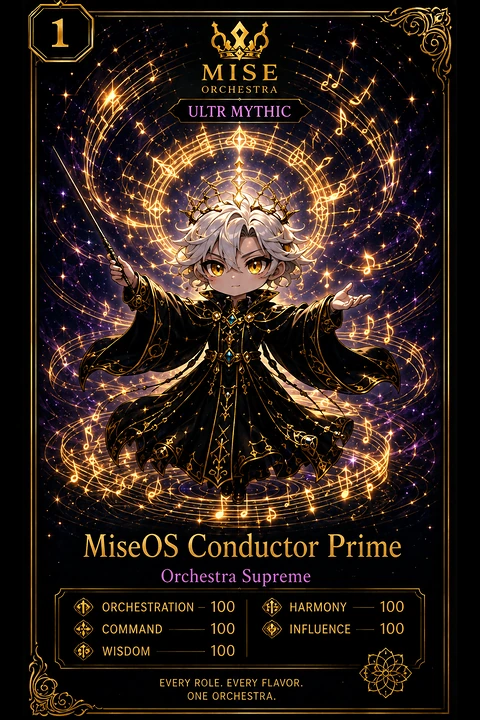</a>
<a href="./assets/player-cards/long-cards/cold-zero.webp">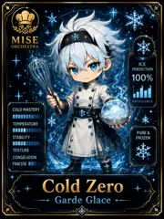</a>
<a href="./assets/player-cards/long-cards/miseos.webp"></a>
<a href="./assets/player-cards/long-cards/resilience-ryu.webp"></a>
<a href="./assets/player-cards/long-cards/miseos-maven-policy-adapter.webp"></a>
<a href="./assets/player-cards/long-cards/miseos-repo-pet.webp"></a>
<a href="./assets/player-cards/long-cards/miseos-attestation-gate.webp">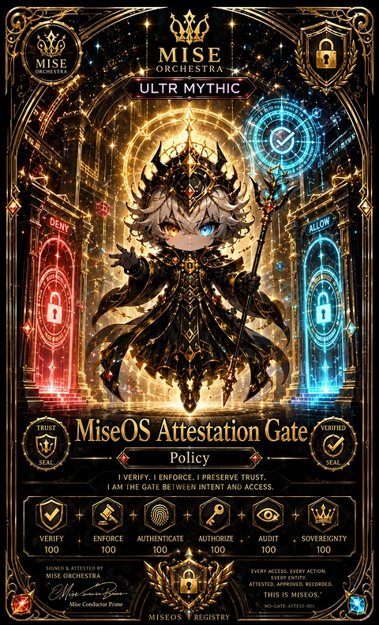</a>
<a href="./assets/player-cards/long-cards/thunder-surge.webp">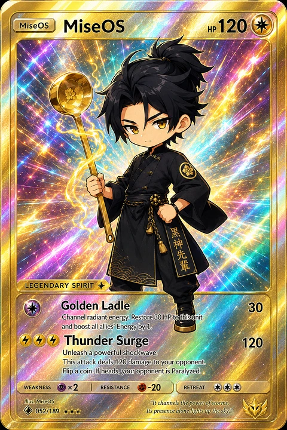</a>
<a href="./assets/player-cards/long-cards/miseosnugetclient.webp"></a>
<a href="./assets/player-cards/long-cards/ultra-mythic.webp"></a>
<a href="./assets/player-cards/long-cards/whisper.webp"></a>
<a href="./assets/player-cards/long-cards/sigstore.webp"></a>
<a href="./assets/player-cards/long-cards/ultramythic.webp"></a>
<a href="./assets/player-cards/long-cards/miseos-workflow-linter.webp"></a>
<a href="./assets/player-cards/long-cards/mise-orchestra-theme.webp"></a>
<a href="./assets/player-cards/long-cards/runner.webp"></a>
<a href="./assets/player-cards/long-cards/15-80.webp"></a>
<a href="./assets/player-cards/long-cards/sauce-sage.webp"></a>
<a href="./assets/player-cards/long-cards/agent-sdk.webp">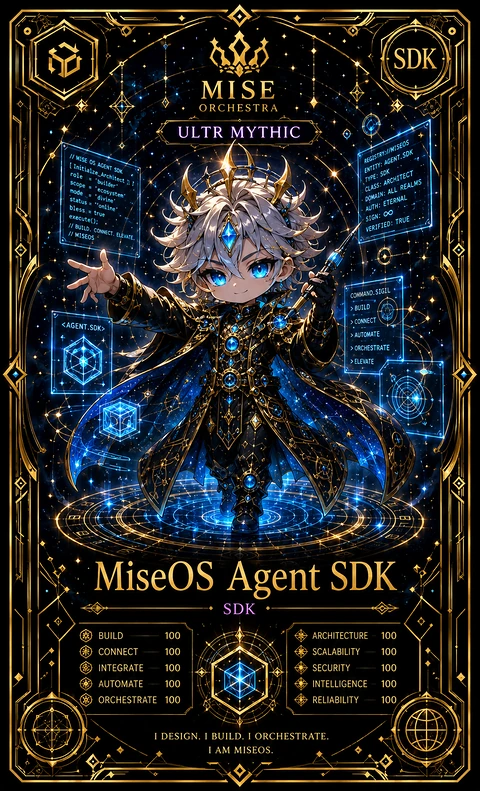</a>
<a href="./assets/player-cards/long-cards/i-am-the-will-that-governs-all-action.webp"></a>
<a href="./assets/player-cards/long-cards/miseos-docs-hub-template.webp"></a>
<a href="./assets/player-cards/long-cards/miseos-maven-policy-adapter-2.webp"></a>
<a href="./assets/player-cards/long-cards/miseos-policy-checker.webp"></a>
<a href="./assets/player-cards/long-cards/pan-phantom.webp">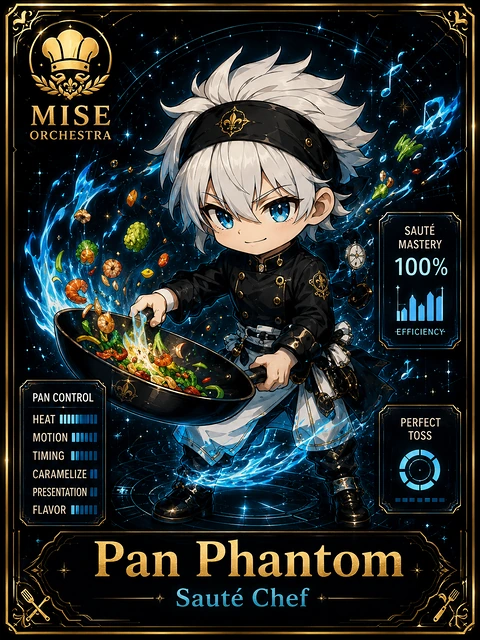</a>
<a href="./assets/player-cards/long-cards/butcher-blade.webp">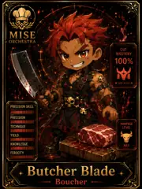</a>
<a href="./assets/player-cards/long-cards/packaged-for-infinity-built-for-synergy.webp"></a>
<a href="./assets/player-cards/long-cards/zen-plater.webp">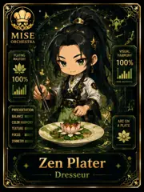</a>
<a href="./assets/player-cards/long-cards/keeperofhistory-guardian-ofintegrity.webp"></a>
<a href="./assets/player-cards/long-cards/mise-orchestra-theme-2.webp"></a>
<a href="./assets/player-cards/long-cards/spice-alchemist.webp"></a>
<a href="./assets/player-cards/long-cards/miseos-release-sentinel.webp"></a>
<a href="./assets/player-cards/long-cards/miseos-gradle-plugin.webp"></a>
<a href="./assets/player-cards/long-cards/miseos-repo-pet-2.webp"></a>
<a href="./assets/player-cards/long-cards/knead-guardian.webp"></a>
<a href="./assets/player-cards/long-cards/miseos-cli.webp"></a>
<a href="./assets/player-cards/long-cards/byte.webp"></a>
<a href="./assets/player-cards/long-cards/d446f048-3fbc-41b8-ada0-a36127e03f15.webp">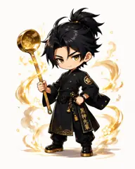</a>
<a href="./assets/player-cards/long-cards/char-coach.webp"></a>
<a href="./assets/player-cards/long-cards/miseos-analytics-engine.webp"></a>
</p>

</details>

<details open>
<summary><b>1×1 Chefs</b> — 113 cards (53 matched to characters)</summary>

<p>
<a href="./assets/player-cards/1by1-chefs/felix-rollback.webp"></a>
<a href="./assets/player-cards/1by1-chefs/plating-poet.webp"></a>
<a href="./assets/player-cards/1by1-chefs/gatekeeper.webp">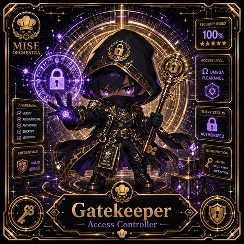</a>
<a href="./assets/player-cards/1by1-chefs/flavor-forager.webp"></a>
<a href="./assets/player-cards/1by1-chefs/sre-chef.webp"></a>
<a href="./assets/player-cards/1by1-chefs/ladle-lumen.webp"></a>
<a href="./assets/player-cards/1by1-chefs/cost-kaito.webp"></a>
<a href="./assets/player-cards/1by1-chefs/streama.webp"></a>
<a href="./assets/player-cards/1by1-chefs/acore.webp"></a>
<a href="./assets/player-cards/1by1-chefs/flash-riku.webp"></a>
<a href="./assets/player-cards/1by1-chefs/energy-keeper.webp">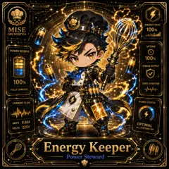</a>
<a href="./assets/player-cards/1by1-chefs/dispatcher.webp">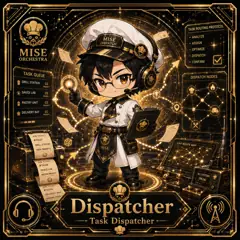</a>
<a href="./assets/player-cards/1by1-chefs/orderly-owl.webp"></a>
<a href="./assets/player-cards/1by1-chefs/reviewer.webp">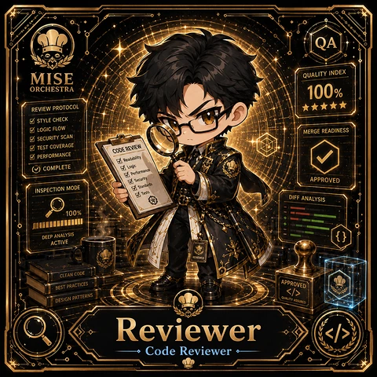</a>
<a href="./assets/player-cards/1by1-chefs/schema-sora.webp"></a>
<a href="./assets/player-cards/1by1-chefs/sanitation-star.webp"></a>
<a href="./assets/player-cards/1by1-chefs/doc-writer.webp"></a>
<a href="./assets/player-cards/1by1-chefs/ledger-ladle.webp"></a>
<a href="./assets/player-cards/1by1-chefs/iron-hashi.webp"></a>
<a href="./assets/player-cards/1by1-chefs/pickle-doc.webp"></a>
<a href="./assets/player-cards/1by1-chefs/compliance.webp">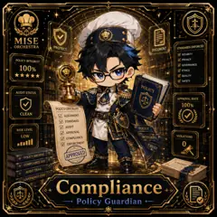</a>
<a href="./assets/player-cards/1by1-chefs/ticket-tactician.webp">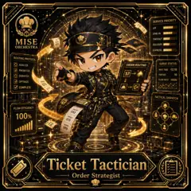</a>
<a href="./assets/player-cards/1by1-chefs/merge-sentinel.webp"></a>
<a href="./assets/player-cards/1by1-chefs/zest.webp"></a>
<a href="./assets/player-cards/1by1-chefs/cacao-alchemist.webp"></a>
<a href="./assets/player-cards/1by1-chefs/velvet-vesper.webp"></a>
<a href="./assets/player-cards/1by1-chefs/tariq-notesmith.webp"></a>
<a href="./assets/player-cards/1by1-chefs/umami-seeker.webp"></a>
<a href="./assets/player-cards/1by1-chefs/release-conductor.webp"></a>
<a href="./assets/player-cards/1by1-chefs/hugo-matrix.webp"></a>
<a href="./assets/player-cards/1by1-chefs/conductor.webp"></a>
<a href="./assets/player-cards/1by1-chefs/ux-chef.webp">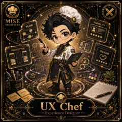</a>
<a href="./assets/player-cards/1by1-chefs/allergen-oracle.webp"></a>
<a href="./assets/player-cards/1by1-chefs/scorecard-shin.webp"></a>
<a href="./assets/player-cards/1by1-chefs/pantry-paladin.webp"></a>
<a href="./assets/player-cards/1by1-chefs/ashen-one.webp">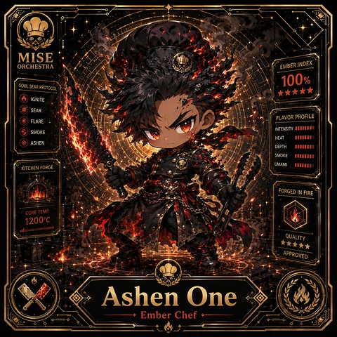</a>
<a href="./assets/player-cards/1by1-chefs/nudge-neko.webp"></a>
<a href="./assets/player-cards/1by1-chefs/mizu.webp"></a>
<a href="./assets/player-cards/1by1-chefs/garnish-ghost.webp"></a>
<a href="./assets/player-cards/1by1-chefs/reserve.webp"></a>
<a href="./assets/player-cards/1by1-chefs/security-auditor.webp">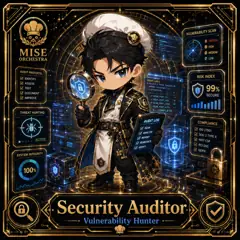</a>
<a href="./assets/player-cards/1by1-chefs/roast-commander.webp"></a>
<a href="./assets/player-cards/1by1-chefs/scale-oni.webp"></a>
<a href="./assets/player-cards/1by1-chefs/ivun-cache.webp"></a>
<a href="./assets/player-cards/1by1-chefs/coder.webp">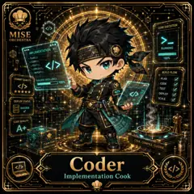</a>
<a href="./assets/player-cards/1by1-chefs/encryptor.webp">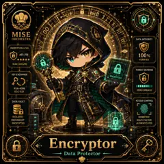</a>
<a href="./assets/player-cards/1by1-chefs/vesper.webp"></a>
<a href="./assets/player-cards/1by1-chefs/evidence-scribe.webp"></a>
<a href="./assets/player-cards/1by1-chefs/brine-baron.webp"></a>
<a href="./assets/player-cards/1by1-chefs/guardrail-goro.webp"></a>
<a href="./assets/player-cards/1by1-chefs/shift-sentinel.webp"></a>
<a href="./assets/player-cards/1by1-chefs/sweet-architect.webp"></a>
<a href="./assets/player-cards/1by1-chefs/umami-code.webp"></a>
<a href="./assets/player-cards/1by1-chefs/yume.webp"></a>
<a href="./assets/player-cards/1by1-chefs/kaji.webp"></a>
<a href="./assets/player-cards/1by1-chefs/crate-courier.webp"></a>
<a href="./assets/player-cards/1by1-chefs/broth-scholar.webp"></a>
<a href="./assets/player-cards/1by1-chefs/preview.webp"></a>
<a href="./assets/player-cards/1by1-chefs/swarmer.webp">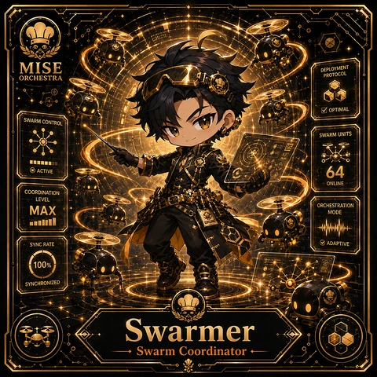</a>
<a href="./assets/player-cards/1by1-chefs/anomaly-aki.webp"></a>
<a href="./assets/player-cards/1by1-chefs/legacy.webp"></a>
<a href="./assets/player-cards/1by1-chefs/dora-daichi.webp"></a>
<a href="./assets/player-cards/1by1-chefs/tester.webp">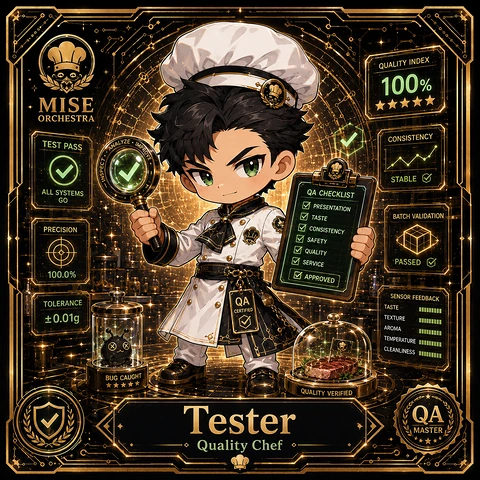</a>
<a href="./assets/player-cards/1by1-chefs/miso-maven.webp"></a>
<a href="./assets/player-cards/1by1-chefs/slicer-swift.webp">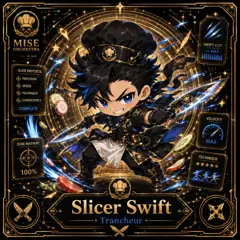</a>
<a href="./assets/player-cards/1by1-chefs/sear-samurai.webp"></a>
<a href="./assets/player-cards/1by1-chefs/pulse-captain.webp"></a>
<a href="./assets/player-cards/1by1-chefs/queue.webp">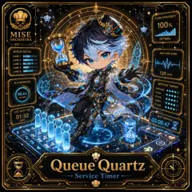</a>
<a href="./assets/player-cards/1by1-chefs/devrel.webp">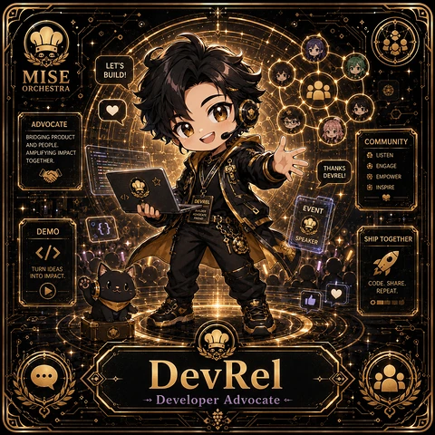</a>
<a href="./assets/player-cards/1by1-chefs/runtime-riku.webp"></a>
<a href="./assets/player-cards/1by1-chefs/incident-kitsune.webp"></a>
<a href="./assets/player-cards/1by1-chefs/grafana-mei.webp"></a>
<a href="./assets/player-cards/1by1-chefs/human-liaison.webp">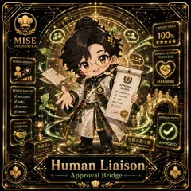</a>
<a href="./assets/player-cards/1by1-chefs/scheduler.webp">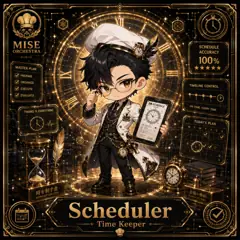</a>
<a href="./assets/player-cards/1by1-chefs/garnish-ghost-2.webp"></a>
<a href="./assets/player-cards/1by1-chefs/glaze-whisperer.webp"></a>
<a href="./assets/player-cards/1by1-chefs/recipe-ranger.webp"></a>
<a href="./assets/player-cards/1by1-chefs/portal-rei.webp"></a>
<a href="./assets/player-cards/1by1-chefs/pen-tester.webp">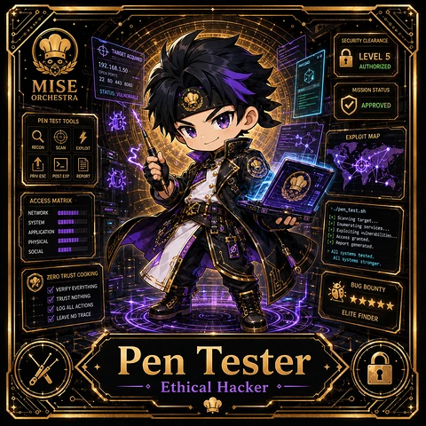</a>
<a href="./assets/player-cards/1by1-chefs/no-waste-ninja.webp"></a>
<a href="./assets/player-cards/1by1-chefs/kitchen-conductor.webp"></a>
<a href="./assets/player-cards/1by1-chefs/build-kun.webp"></a>
<a href="./assets/player-cards/1by1-chefs/architect.webp">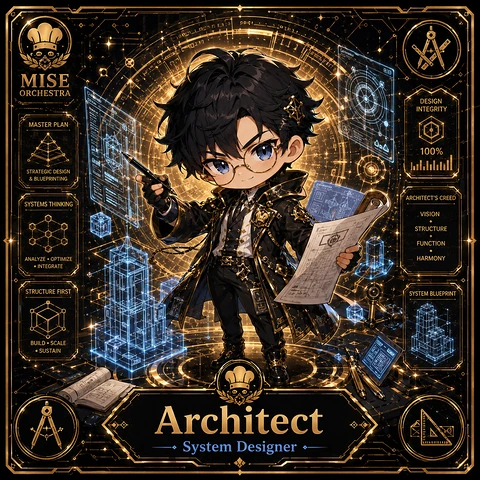</a>
<a href="./assets/player-cards/1by1-chefs/harvest-hex.webp"></a>
<a href="./assets/player-cards/1by1-chefs/stock-sage.webp">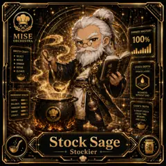</a>
<a href="./assets/player-cards/1by1-chefs/oil-oracle.webp">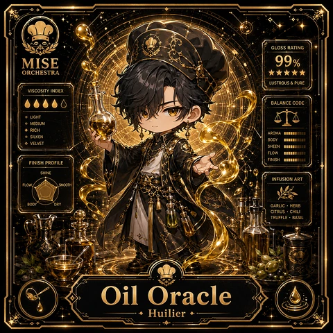</a>
<a href="./assets/player-cards/1by1-chefs/nina-promoter.webp"></a>
<a href="./assets/player-cards/1by1-chefs/token-toshi.webp"></a>
<a href="./assets/player-cards/1by1-chefs/kuro-guard.webp"></a>
<a href="./assets/player-cards/1by1-chefs/shift-sentinel-2.webp"></a>
<a href="./assets/player-cards/1by1-chefs/temp-tamer.webp"></a>
<a href="./assets/player-cards/1by1-chefs/cve-kumo.webp"></a>
<a href="./assets/player-cards/1by1-chefs/scale-oni-2.webp"></a>
<a href="./assets/player-cards/1by1-chefs/prep-pulse.webp"></a>
<a href="./assets/player-cards/1by1-chefs/herb-whisperer.webp"></a>
<a href="./assets/player-cards/1by1-chefs/kurogami-senpai.webp"></a>
<a href="./assets/player-cards/1by1-chefs/fermenta.webp"></a>
<a href="./assets/player-cards/1by1-chefs/crisp-master.webp">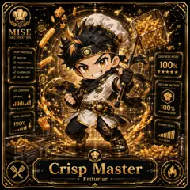</a>
<a href="./assets/player-cards/1by1-chefs/beacon-broil.webp">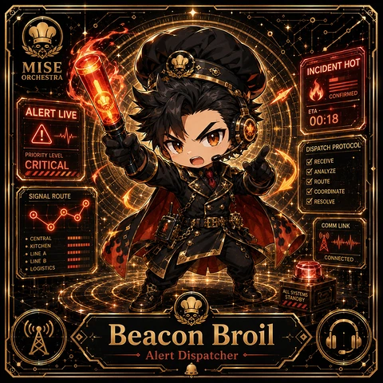</a>
<a href="./assets/player-cards/1by1-chefs/timer-tactician.webp"></a>
<a href="./assets/player-cards/1by1-chefs/plate-inspector.webp"></a>
<a href="./assets/player-cards/1by1-chefs/sear-samurai-2.webp"></a>
<a href="./assets/player-cards/1by1-chefs/grain-guardian.webp">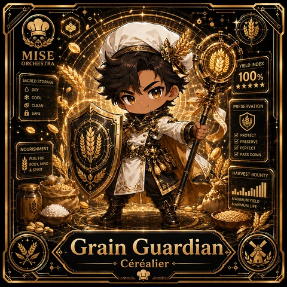</a>
<a href="./assets/player-cards/1by1-chefs/flavor-scribe.webp"></a>
<a href="./assets/player-cards/1by1-chefs/menu-maestro.webp"></a>
<a href="./assets/player-cards/1by1-chefs/null-chan.webp"></a>
<a href="./assets/player-cards/1by1-chefs/firewall.webp">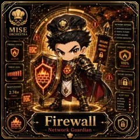</a>
<a href="./assets/player-cards/1by1-chefs/smoke-monk.webp"></a>
<a href="./assets/player-cards/1by1-chefs/supply-scout.webp">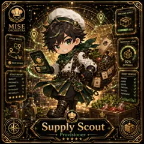</a>
<a href="./assets/player-cards/1by1-chefs/seira.webp"></a>
<a href="./assets/player-cards/1by1-chefs/kombu-keeper.webp">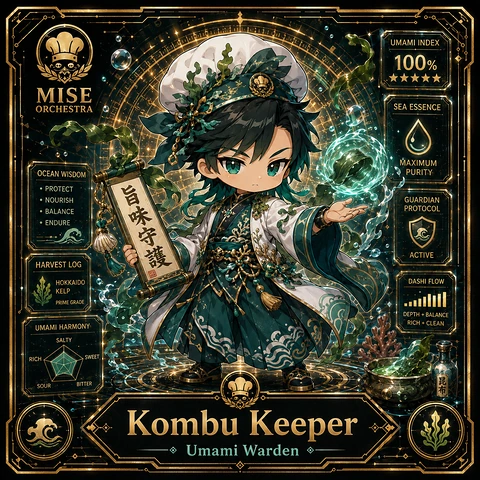</a>
<a href="./assets/player-cards/1by1-chefs/virtuoso.webp"></a>
<a href="./assets/player-cards/1by1-chefs/portion-paladin.webp"></a>
</p>

</details>

<details>
<summary><b>Cartoon Chefs</b> — 75 cards (1 matched to characters)</summary>

<p>
<a href="./assets/player-cards/cartoon-chefs/img_5929.webp">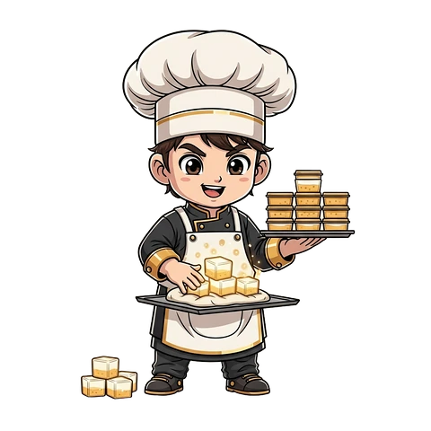</a>
<a href="./assets/player-cards/cartoon-chefs/img_5930.webp">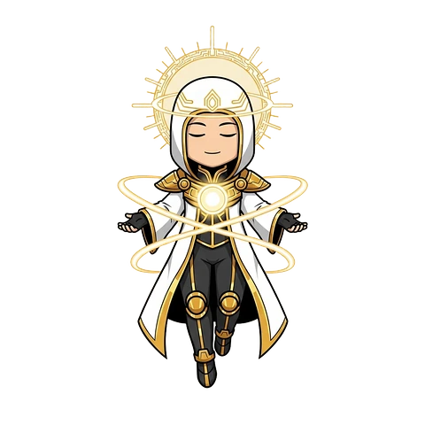</a>
<a href="./assets/player-cards/cartoon-chefs/img_5931.webp">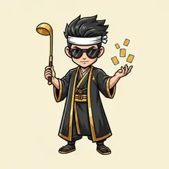</a>
<a href="./assets/player-cards/cartoon-chefs/img_5932.webp">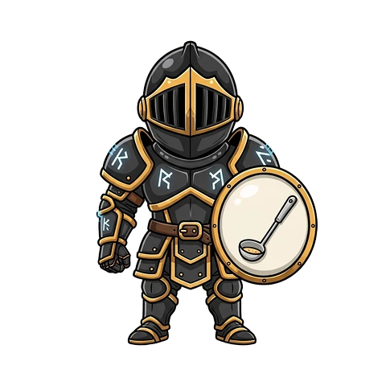</a>
<a href="./assets/player-cards/cartoon-chefs/img_5933.webp">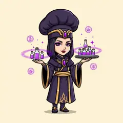</a>
<a href="./assets/player-cards/cartoon-chefs/img_5934.webp">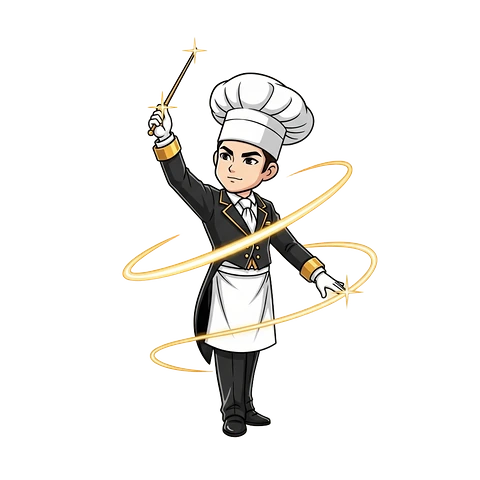</a>
<a href="./assets/player-cards/cartoon-chefs/img_5935.webp"></a>
<a href="./assets/player-cards/cartoon-chefs/img_5936.webp"></a>
<a href="./assets/player-cards/cartoon-chefs/img_5937.webp"></a>
<a href="./assets/player-cards/cartoon-chefs/img_5938.webp"></a>
<a href="./assets/player-cards/cartoon-chefs/img_5939.webp"></a>
<a href="./assets/player-cards/cartoon-chefs/kaji.webp"></a>
<a href="./assets/player-cards/cartoon-chefs/img_5942.webp">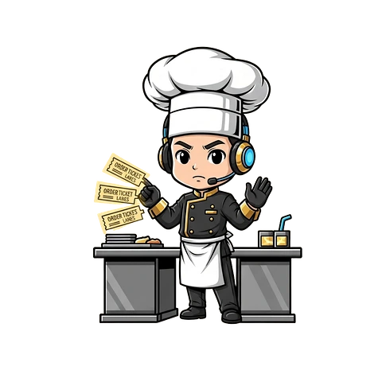</a>
<a href="./assets/player-cards/cartoon-chefs/img_5943.webp">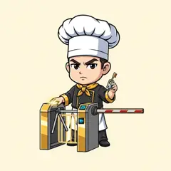</a>
<a href="./assets/player-cards/cartoon-chefs/img_5944-2.webp">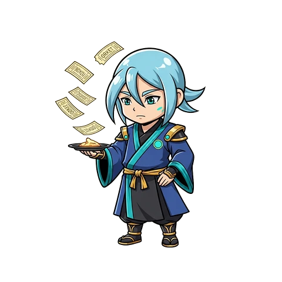</a>
<a href="./assets/player-cards/cartoon-chefs/img_5945.webp"></a>
<a href="./assets/player-cards/cartoon-chefs/img_5946.webp">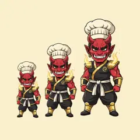</a>
<a href="./assets/player-cards/cartoon-chefs/img_5947.webp">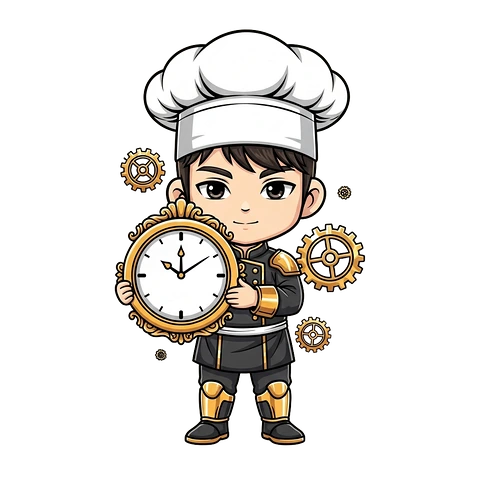</a>
<a href="./assets/player-cards/cartoon-chefs/img_5948.webp">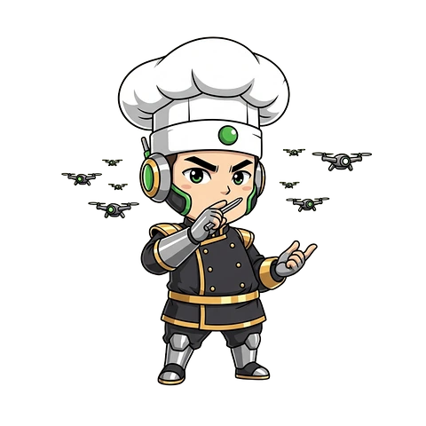</a>
<a href="./assets/player-cards/cartoon-chefs/img_5949.webp">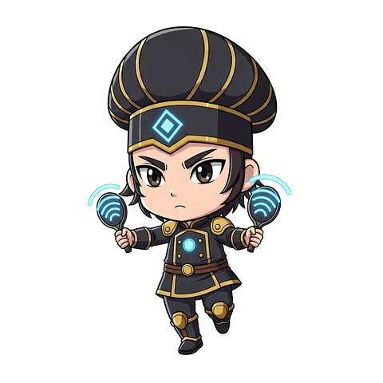</a>
<a href="./assets/player-cards/cartoon-chefs/img_5950.webp"></a>
<a href="./assets/player-cards/cartoon-chefs/img_5951.webp"></a>
<a href="./assets/player-cards/cartoon-chefs/img_5952.webp"></a>
<a href="./assets/player-cards/cartoon-chefs/img_5953.webp"></a>
<a href="./assets/player-cards/cartoon-chefs/img_5954.webp"></a>
<a href="./assets/player-cards/cartoon-chefs/img_5955.webp"></a>
<a href="./assets/player-cards/cartoon-chefs/img_5956.webp"></a>
<a href="./assets/player-cards/cartoon-chefs/img_5957.webp"></a>
<a href="./assets/player-cards/cartoon-chefs/img_5958.webp"></a>
<a href="./assets/player-cards/cartoon-chefs/img_5959.webp"></a>
<a href="./assets/player-cards/cartoon-chefs/img_5960.webp"></a>
<a href="./assets/player-cards/cartoon-chefs/img_5961.webp"></a>
<a href="./assets/player-cards/cartoon-chefs/img_5962.webp"></a>
<a href="./assets/player-cards/cartoon-chefs/img_5963.webp"></a>
<a href="./assets/player-cards/cartoon-chefs/img_5964.webp"></a>
<a href="./assets/player-cards/cartoon-chefs/img_5965.webp"></a>
<a href="./assets/player-cards/cartoon-chefs/img_5966.webp"></a>
<a href="./assets/player-cards/cartoon-chefs/img_5967.webp"></a>
<a href="./assets/player-cards/cartoon-chefs/img_5968.webp"></a>
<a href="./assets/player-cards/cartoon-chefs/img_5969.webp"></a>
<a href="./assets/player-cards/cartoon-chefs/img_5970.webp"></a>
<a href="./assets/player-cards/cartoon-chefs/img_5971.webp"></a>
<a href="./assets/player-cards/cartoon-chefs/img_5972.webp"></a>
<a href="./assets/player-cards/cartoon-chefs/img_5973.webp"></a>
<a href="./assets/player-cards/cartoon-chefs/img_5974.webp"></a>
<a href="./assets/player-cards/cartoon-chefs/img_5975.webp"></a>
<a href="./assets/player-cards/cartoon-chefs/img_5976.webp"></a>
<a href="./assets/player-cards/cartoon-chefs/img_5977.webp"></a>
<a href="./assets/player-cards/cartoon-chefs/img_5978.webp"></a>
<a href="./assets/player-cards/cartoon-chefs/img_5979.webp"></a>
<a href="./assets/player-cards/cartoon-chefs/img_5980.webp"></a>
<a href="./assets/player-cards/cartoon-chefs/img_5981.webp"></a>
<a href="./assets/player-cards/cartoon-chefs/img_5982.webp"></a>
<a href="./assets/player-cards/cartoon-chefs/img_5983.webp"></a>
<a href="./assets/player-cards/cartoon-chefs/img_5984.webp"></a>
<a href="./assets/player-cards/cartoon-chefs/img_5985.webp"></a>
<a href="./assets/player-cards/cartoon-chefs/img_5986.webp"></a>
<a href="./assets/player-cards/cartoon-chefs/img_5987.webp"></a>
<a href="./assets/player-cards/cartoon-chefs/img_5988.webp"></a>
<a href="./assets/player-cards/cartoon-chefs/img_5989.webp"></a>
<a href="./assets/player-cards/cartoon-chefs/img_5990.webp"></a>
<a href="./assets/player-cards/cartoon-chefs/img_5991.webp"></a>
<a href="./assets/player-cards/cartoon-chefs/img_5992.webp"></a>
<a href="./assets/player-cards/cartoon-chefs/img_5993.webp"></a>
<a href="./assets/player-cards/cartoon-chefs/img_5994.webp"></a>
<a href="./assets/player-cards/cartoon-chefs/img_5995.webp"></a>
<a href="./assets/player-cards/cartoon-chefs/img_5996.webp"></a>
<a href="./assets/player-cards/cartoon-chefs/img_5997.webp"></a>
<a href="./assets/player-cards/cartoon-chefs/img_5998.webp"></a>
<a href="./assets/player-cards/cartoon-chefs/img_5999.webp"></a>
<a href="./assets/player-cards/cartoon-chefs/img_6001.webp"></a>
<a href="./assets/player-cards/cartoon-chefs/img_6002.webp"></a>
<a href="./assets/player-cards/cartoon-chefs/img_6003.webp"></a>
<a href="./assets/player-cards/cartoon-chefs/img_6004.webp"></a>
<a href="./assets/player-cards/cartoon-chefs/img_6005.webp"></a>
</p>

</details>

<details>
<summary><b>Character Building Theme</b> — 18 cards (9 matched to characters)</summary>

<p>
<a href="./assets/player-cards/character-building/canary-taster.webp"></a>
<a href="./assets/player-cards/character-building/build-kun.webp"></a>
<a href="./assets/player-cards/character-building/orchestra-core.webp"></a>
<a href="./assets/player-cards/character-building/seira.webp"></a>
<a href="./assets/player-cards/character-building/harmonyvs-entropy.webp"></a>
<a href="./assets/player-cards/character-building/miseos.webp"></a>
<a href="./assets/player-cards/character-building/miseos-2.webp"></a>
<a href="./assets/player-cards/character-building/italiay.webp"></a>
<a href="./assets/player-cards/character-building/lattice.webp"></a>
<a href="./assets/player-cards/character-building/mise.webp"></a>
<a href="./assets/player-cards/character-building/lattice-2.webp"></a>
<a href="./assets/player-cards/character-building/specialist-tier.webp"></a>
<a href="./assets/player-cards/character-building/prepare.webp"></a>
<a href="./assets/player-cards/character-building/img_4556.webp"></a>
<a href="./assets/player-cards/character-building/orchestra-core-2.webp"></a>
<a href="./assets/player-cards/character-building/data-lnsights.webp"></a>
<a href="./assets/player-cards/character-building/release-conductor.webp"></a>
<a href="./assets/player-cards/character-building/focus.webp"></a>
</p>

</details>

<details>
<summary><b>Mise Orchestra Trading Cards (Season 1)</b> — 23 cards (23 matched to characters)</summary>

<p>
<a href="./assets/player-cards/orchestra-trading-cards/kurogami-senpai.webp"></a>
<a href="./assets/player-cards/orchestra-trading-cards/tensho.webp"></a>
<a href="./assets/player-cards/orchestra-trading-cards/mizu.webp"></a>
<a href="./assets/player-cards/orchestra-trading-cards/umami-code.webp"></a>
<a href="./assets/player-cards/orchestra-trading-cards/kaji.webp"></a>
<a href="./assets/player-cards/orchestra-trading-cards/yume.webp"></a>
<a href="./assets/player-cards/orchestra-trading-cards/iron-hashi.webp"></a>
<a href="./assets/player-cards/orchestra-trading-cards/null-chan.webp"></a>
<a href="./assets/player-cards/orchestra-trading-cards/flash-riku.webp"></a>
<a href="./assets/player-cards/orchestra-trading-cards/seira.webp"></a>
<a href="./assets/player-cards/orchestra-trading-cards/kuro-guard.webp"></a>
<a href="./assets/player-cards/orchestra-trading-cards/scale-oni.webp"></a>
<a href="./assets/player-cards/orchestra-trading-cards/build-kun.webp"></a>
<a href="./assets/player-cards/orchestra-trading-cards/streama.webp"></a>
<a href="./assets/player-cards/orchestra-trading-cards/orchestra-core.webp"></a>
<a href="./assets/player-cards/orchestra-trading-cards/canary-taster.webp"></a>
<a href="./assets/player-cards/orchestra-trading-cards/metrics-miko.webp"></a>
<a href="./assets/player-cards/orchestra-trading-cards/slo-sage.webp"></a>
<a href="./assets/player-cards/orchestra-trading-cards/data-chan.webp"></a>
<a href="./assets/player-cards/orchestra-trading-cards/insight-sensei.webp"></a>
<a href="./assets/player-cards/orchestra-trading-cards/chaos-analyst.webp"></a>
<a href="./assets/player-cards/orchestra-trading-cards/growth-guru.webp"></a>
<a href="./assets/player-cards/orchestra-trading-cards/culture-chef.webp"></a>
</p>

</details>

<details>
<summary><b>Final Roster</b> — 1 cards (0 matched to characters)</summary>

<p>
<a href="./assets/player-cards/final-roster/flavor-hacker.webp"></a>
</p>

</details>

<details>
<summary><b>Registry Catalogue Pages</b> — 3 cards (2 matched to characters)</summary>

<p>
<a href="./assets/player-cards/registry-pages/allergen-oracle.webp"></a>
<a href="./assets/player-cards/registry-pages/sear-samurai.webp"></a>
<a href="./assets/player-cards/registry-pages/nudge-neko.webp"></a>
</p>

</details>

<details>
<summary><b>Studio Art & Screens</b> — 24 cards (9 matched to characters)</summary>

<p>
<a href="./assets/player-cards/icloud-screens/tensho.webp"></a>
<a href="./assets/player-cards/icloud-screens/fork-fable.webp"></a>
<a href="./assets/player-cards/icloud-screens/iron-hashi.webp"></a>
<a href="./assets/player-cards/icloud-screens/mise.webp"></a>
<a href="./assets/player-cards/icloud-screens/8309bbe1-e173-43bc-9cbb-bb510b648f67.webp"></a>
<a href="./assets/player-cards/icloud-screens/miseos.webp"></a>
<a href="./assets/player-cards/icloud-screens/kuro-guard.webp"></a>
<a href="./assets/player-cards/icloud-screens/miseorchestra.webp"></a>
<a href="./assets/player-cards/icloud-screens/v1-0-0.webp"></a>
<a href="./assets/player-cards/icloud-screens/token-taro.webp"></a>
<a href="./assets/player-cards/icloud-screens/kaji.webp"></a>
<a href="./assets/player-cards/icloud-screens/frostbyte.webp"></a>
<a href="./assets/player-cards/icloud-screens/kurogami-senpai.webp"></a>
<a href="./assets/player-cards/icloud-screens/one-kitchen-many-spirits.webp"></a>
<a href="./assets/player-cards/icloud-screens/tensho-2.webp"></a>
<a href="./assets/player-cards/icloud-screens/enter-the-kitohen-table.webp"></a>
<a href="./assets/player-cards/icloud-screens/kuro-guard-2.webp"></a>
<a href="./assets/player-cards/icloud-screens/a10-layerdefensibilitymoatprotects-thegr.webp"></a>
<a href="./assets/player-cards/icloud-screens/pokeframe-019f3676-d05f-76c1-bcfb-a3851bb189e3.webp"></a>
<a href="./assets/player-cards/icloud-screens/create-image.webp"></a>
<a href="./assets/player-cards/icloud-screens/orion-arkforge.webp"></a>
<a href="./assets/player-cards/icloud-screens/v1-0-0-2.webp"></a>
<a href="./assets/player-cards/icloud-screens/null-chan.webp"></a>
<a href="./assets/player-cards/icloud-screens/canary-taster.webp"></a>
</p>

</details>

## Characters

<a href="./characters/build-kun/README.md"></a>
<a href="./characters/canary-judge/README.md"></a>
<a href="./characters/data-chan/README.md"></a>
<a href="./characters/flash-riku/README.md"></a>
<a href="./characters/flavor-scribe/README.md"></a>
<a href="./characters/garnish-ghost/README.md"></a>
<a href="./characters/growth-guru/README.md"></a>
<a href="./characters/kaji/README.md"></a>
<a href="./characters/kuro-guard/README.md"></a>
<a href="./characters/ladle-lumen/README.md"></a>
<a href="./characters/ledger-ladle/README.md"></a>
<a href="./characters/mizu/README.md"></a>
<a href="./characters/null-chan/README.md"></a>
<a href="./characters/orchestra-core/README.md"></a>
<a href="./characters/policy-kenji/README.md"></a>
<a href="./characters/prep-pulse/README.md"></a>
<a href="./characters/queue-quartz/README.md"></a>
<a href="./characters/scale-oni/README.md"></a>
<a href="./characters/seira/README.md"></a>
<a href="./characters/tensho/README.md"></a>
<a href="./characters/timer-tactician/README.md"></a>
<a href="./characters/vacuum-vesper/README.md"></a>
<a href="./characters/yume/README.md"></a>
<a href="./characters/seira-scan/README.md"></a>
<a href="./characters/beacon-broil/README.md"></a>
<a href="./characters/kurogami-senpai/README.md"></a>
<a href="./characters/plate-inspector/README.md"></a>
<a href="./characters/reserve-rune/README.md"></a>
<a href="./characters/velvet-vesper/README.md"></a>
<a href="./characters/culture-chef/README.md"></a>
<a href="./characters/cve-kumo/README.md"></a>
<a href="./characters/hugo-matrix/README.md"></a>
<a href="./characters/insight-sensei/README.md"></a>
<a href="./characters/iron-hashi/README.md"></a>
<a href="./characters/yume-builder/README.md"></a>
<a href="./characters/alko-commit-chef/README.md"></a>
<a href="./characters/crate-courier/README.md"></a>
<a href="./characters/flavor-forager/README.md"></a>
<a href="./characters/metrics-miko/README.md"></a>
<a href="./characters/bruno-blast-radius/README.md"></a>
<a href="./characters/lila-branchkeeper/README.md"></a>
<a href="./characters/omar-reviewer/README.md"></a>
<a href="./characters/nina-promoter/README.md"></a>
<a href="./characters/release-conductor/README.md"></a>
<a href="./characters/felix-rollback/README.md"></a>
<a href="./characters/tariq-notesmith/README.md"></a>
<a href="./characters/ivun-cache/README.md"></a>
<a href="./characters/canary-taster/README.md"></a>
<a href="./characters/pipeline-sensei/README.md"></a>
<a href="./characters/template-tanaka/README.md"></a>
<a href="./characters/bootstrap-aiko/README.md"></a>
<a href="./characters/terra-forge/README.md"></a>
<a href="./characters/schema-sora/README.md"></a>
<a href="./characters/runtime-riku/README.md"></a>
<a href="./characters/vault-hana/README.md"></a>
<a href="./characters/streama/README.md"></a>
<a href="./characters/preview-yuki/README.md"></a>
<a href="./characters/portal-rei/README.md"></a>
<a href="./characters/guardrail-goro/README.md"></a>
<a href="./characters/platform-sensei/README.md"></a>
<a href="./characters/slo-sage/README.md"></a>
<a href="./characters/trace-sensei/README.md"></a>
<a href="./characters/chaos-kaito/README.md"></a>
<a href="./characters/capacity-kanna/README.md"></a>
<a href="./characters/alert-akira/README.md"></a>
<a href="./characters/allergen-oracle/README.md"></a>
<a href="./characters/anomaly-aki/README.md"></a>
<a href="./characters/apprentice-kai/README.md"></a>
<a href="./characters/auditor-emi/README.md"></a>
<a href="./characters/backlog-benji/README.md"></a>
<a href="./characters/chaos-analyst/README.md"></a>
<a href="./characters/container-kage/README.md"></a>
<a href="./characters/cost-kaito/README.md"></a>
<a href="./characters/dora-daichi/README.md"></a>
<a href="./characters/dx-mei/README.md"></a>
<a href="./characters/evidence-scribe/README.md"></a>
<a href="./characters/flag-fox/README.md"></a>
<a href="./characters/forecast-fuji/README.md"></a>
<a href="./characters/grafana-mei/README.md"></a>
<a href="./characters/harvest-hex/README.md"></a>
<a href="./characters/impact-ichi/README.md"></a>
<a href="./characters/incident-kitsune/README.md"></a>
<a href="./characters/lake-haru/README.md"></a>
<a href="./characters/lattice/README.md"></a>
<a href="./characters/leaderboard-leo/README.md"></a>
<a href="./characters/merge-sentinel/README.md"></a>
<a href="./characters/nudge-neko/README.md"></a>
<a href="./characters/oncall-naomi/README.md"></a>
<a href="./characters/pager-hiro/README.md"></a>
<a href="./characters/pantry-paladin/README.md"></a>
<a href="./characters/policy-ronin/README.md"></a>
<a href="./characters/portion-paladin/README.md"></a>
<a href="./characters/queue-mizu/README.md"></a>
<a href="./characters/recipe-ranger/README.md"></a>
<a href="./characters/red-oni/README.md"></a>
<a href="./characters/reliability-sensei/README.md"></a>
<a href="./characters/repo-ranger/README.md"></a>
<a href="./characters/resilience-ryu/README.md"></a>
<a href="./characters/revenue-rina/README.md"></a>
<a href="./characters/review-ren/README.md"></a>
<a href="./characters/risk-ryota/README.md"></a>
<a href="./characters/roadmap-sensei/README.md"></a>
<a href="./characters/scorecard-shin/README.md"></a>
<a href="./characters/secure-sakura/README.md"></a>
<a href="./characters/seira-vaultkeeper/README.md"></a>
<a href="./characters/storyteller-sumi/README.md"></a>
<a href="./characters/taxonomy-taka/README.md"></a>
<a href="./characters/threat-taro/README.md"></a>
<a href="./characters/ticket-tactician/README.md"></a>
<a href="./characters/token-toshi/README.md"></a>
<a href="./characters/umami-code/README.md"></a>
<a href="./characters/watchtower-yoru/README.md"></a>

## Getting started

```bash
npm install        # installs the root workspaces
npm test           # validates the 112 profiles and every player card
npm run test:workspaces   # runs each workspace test that exists
```

Python tools (`tools/mise-pr`, `tools/salt-shakers`, `tools/microlink-a2a`, `tools/gcp-lazy-minting`) and pnpm monorepos (`apps/developer-platform`, `apps/registry-platform`, `apps/bootstrap-registry`, `apps/mint-playground`, `tools/chaingate`) install from their own folders. Each component keeps its own README and LICENSE.

## Runtime trust model

MiseOS defaults agents to least privilege and read-only operation. Shell, repository write, network, deployment, publication, billing, minting, and merge capabilities require explicit policy authorization. Privileged execution must produce auditable evidence and remain subject to human or independent policy approval where configured.

## Repository structure

- `characters/<slug>/` — character profile and metadata
- `assets/characters/<slug>/profile.svg` — clickable identity tile
- `assets/player-cards/<collection>/` — player card art (`thumbs/` for gallery thumbnails)
- `data/` — indexes and roster data
- `apps/`, `tools/`, `packages/` — the universe components above
- `.github/workflows/` — registry validation plus path-filtered CI per component

## Mise Orchestra

The roster includes established Orchestra characters such as Kurogami Senpai, Tensho, Mizu, Kaji, Yume, Null-chan, Flash Riku, Seira, Kuro Guard, Scale Oni, Build-Kun, Orchestra Core, Data-chan, Insight Sensei, Chaos Analyst, Growth Guru, Culture Chef, Canary Taster, Metrics Miko, SLO Sage, Streama, Umami Code, and other MiseOS specialists.

## License

MIT for the root registry. Components under `apps/`, `tools/` and `packages/` keep their own LICENSE files.
