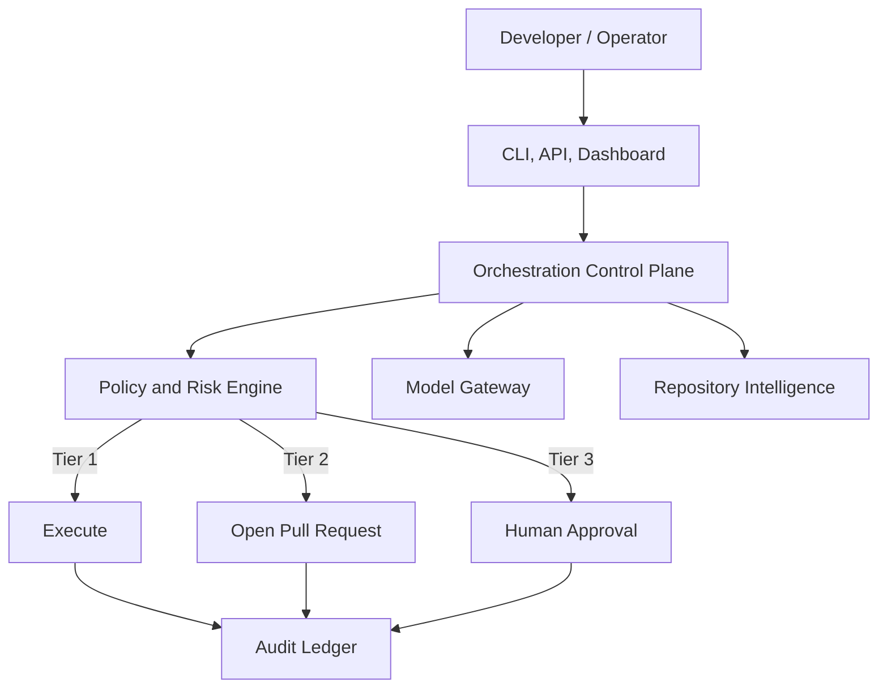

# Architecture

MiseOS Repo Steward separates model recommendations from policy-controlled execution.

Recommended hosted stack: Next.js, TypeScript or FastAPI, PostgreSQL, Vault, OpenTelemetry, Docker, Kubernetes, and a GitHub App. The open-core package remains provider-neutral.
