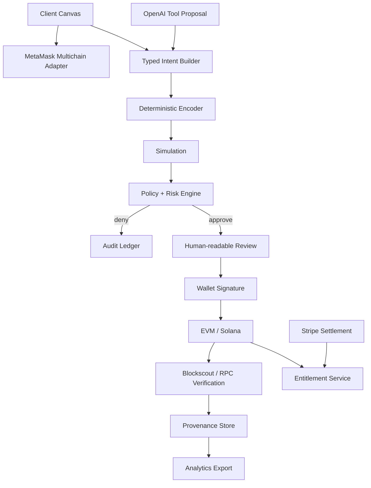

<div align="center">

# MiseOS ChainGate

### Human-approved multichain trust infrastructure for AI-assisted blockchain applications

[](https://github.com/GoodShyt-Group/miseos-chaingate/actions/workflows/ci.yml)
[](https://github.com/GoodShyt-Group/miseos-chaingate/actions/workflows/security.yml)
[](LICENSE)
[](package.json)
[](CHANGELOG.md)

**AI proposes. Policy verifies. Humans approve. Wallets sign. Chains prove.**

</div>

> [!IMPORTANT]
> ChainGate is an alpha security architecture and reference implementation. It is not audited and must not custody production private keys or move mainnet funds without independent review.

## Table of contents

- [Why ChainGate](#why-chaingate)
- [Core guarantees](#core-guarantees)
- [Architecture](#architecture)
- [Repository map](#repository-map)
- [Quick start](#quick-start)
- [Example workflow](#example-workflow)
- [Configuration](#configuration)
- [Development](#development)
- [Documentation](#documentation)
- [Security model](#security-model)
- [Roadmap](#roadmap)
- [Contributing](#contributing)
- [License and support](#license-and-support)

## Why ChainGate

AI agents can explain blockchain operations and prepare structured intents, but they should not silently control user wallets. ChainGate creates a deterministic boundary between model-generated proposals and irreversible execution.

It combines:

- MetaMask Connect and CAIP-style multichain sessions
- EIP-1193 provider boundaries and EIP-6963 wallet discovery
- Typed transaction intents and deterministic ABI builders
- Simulation, allowlists, risk tiers, and human approval
- Artifact hashing and on-chain provenance registration
- Blockscout verification and normalized transaction receipts
- Stripe entitlement evidence and DigitalOcean object storage
- Airbyte-ready analytics and structured observability
- Advisory intelligence adapters for protocol and search research

## Core guarantees

1. **No private-key custody.** ChainGate never requests seed phrases or exports wallet keys.
2. **No direct model execution.** Models may select typed tools; deterministic code creates the transaction request.
3. **Least privilege.** Sessions request only the required chains, accounts, methods, and duration.
4. **Simulation before signing.** Contract writes must pass simulation and policy evaluation.
5. **Explicit approval.** The connected wallet signs only after a human-readable review.
6. **Independent verification.** Receipts are normalized from chain or explorer data after broadcast.
7. **Evidence separation.** Search and market intelligence inform decisions but never authorize them.

## Architecture



See [the documentation index](docs/README.md).

## Repository map

```text
apps/proof-registry/          Reference application workflow
contracts/proof-registry/     Minimal immutable artifact registry
packages/core/                Intents, policy, authentication, provenance
packages/metamask-adapter/    Wallet discovery and multichain session adapter
packages/agent-tools/         Typed AI tool boundary
packages/blockscout/          Receipt normalization
packages/entitlements/        Unified payment/on-chain entitlement evidence
packages/integrations/        OpenAI, Stripe, Spaces, Airbyte, intelligence
packages/observability/       Structured audit events
schemas/                      JSON Schemas for external boundaries
database/                     PostgreSQL reference schema
docs/                         Architecture, operations, security, ADRs
examples/                     Copyable integration examples
.github/                      CI, security, release, issue and PR automation
```

## Quick start

### Prerequisites

- Node.js 22 or later
- Corepack
- Docker with Compose
- Git
- Optional: Foundry for Solidity compilation and tests

```bash
git clone https://github.com/GoodShyt-Group/miseos-chaingate.git
cd miseos-chaingate
corepack enable
pnpm install
cp .env.example .env
docker compose up -d
pnpm validate
```

## Example workflow

```text
Upload artifact
→ calculate SHA-256
→ store binary in DigitalOcean Spaces
→ build signed provenance manifest
→ create typed registerArtifact intent
→ deterministically encode calldata
→ simulate on Base Sepolia
→ evaluate contract, value, expiry, and method policy
→ show human-readable review
→ request MetaMask signature
→ broadcast
→ verify with RPC/Blockscout
→ persist receipt and analytics event
```

## Configuration

| Variable | Purpose | Secret |
|---|---|---:|
| `DATABASE_URL` | PostgreSQL connection | Yes |
| `REDIS_URL` | Nonces, rate limits, ephemeral state | Yes |
| `METAMASK_INFURA_API_KEY` | Supported RPC and relay access | Yes |
| `OPENAI_API_KEY` | Typed intent proposal | Yes |
| `STRIPE_WEBHOOK_SECRET` | Webhook signature verification | Yes |
| `SPACES_ACCESS_KEY_ID` | Object storage access | Yes |
| `SPACES_SECRET_ACCESS_KEY` | Object storage secret | Yes |
| `BLOCKSCOUT_API_URL` | Chain explorer API base | No |
| `PROOF_REGISTRY_ADDRESS` | Deployed registry contract | No |

## Development

```bash
pnpm format:check
pnpm lint
pnpm typecheck
pnpm test
pnpm build
pnpm docs:check
pnpm contracts:check
```

## Documentation

Start with the [documentation index](docs/README.md).

## Security model

```text
UUID identifies.
Wallet signatures authenticate.
Simulation predicts.
Policy authorizes.
Humans approve.
The blockchain records.
Provenance explains.
```

## Roadmap

- [x] Typed intent and policy core
- [x] MetaMask adapter boundary and EIP-6963 discovery
- [x] Proof Registry contract and provenance workflow
- [x] Blockscout, Stripe, Spaces, Airbyte, and OpenAI adapters
- [x] CI, security workflows, governance files, and release process
- [ ] Pin and integrate the production MetaMask Connect package API
- [ ] Add EVM and Solana signature verification
- [ ] Add Foundry unit, fuzz, and invariant tests
- [ ] Deploy Base Sepolia reference environment
- [ ] Add transaction simulation provider implementations
- [ ] Add browser UI with accessible transaction previews
- [ ] Add C2PA media provenance and COSE-signed release manifests
- [ ] Complete external security audit before mainnet use

## Contributing

Changes affecting authorization, wallet sessions, signatures, contracts, or settlement require tests, threat-model notes, and a security reviewer.

## License and support

Apache-2.0 is the current implementation assumption and should be confirmed by GoodShyt Group Inc. before public release.

<div align="center">

**Good People. Good Things in Motion.**

</div>
