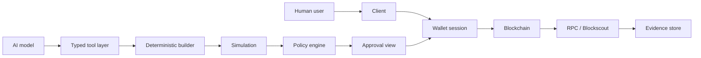

# Architecture

## Purpose

MiseOS ChainGate is a multichain trust gateway that separates AI assistance from transaction authority. It lets applications use models for structured reasoning while preserving wallet self-custody, deterministic transaction construction, policy enforcement, explicit approval, and independent verification.

## Trust boundaries



The AI boundary is intentionally one-way: a model can propose a typed operation, but only trusted code can encode, simulate, authorize, present, sign, and submit it.

## Components

### Client Canvas

Presents wallet connection, intent review, simulation details, permissions, costs, permanence, and final state. It must invalidate previews after account, chain, calldata, fee, or policy changes.

### MetaMask adapter

Encapsulates MetaMask Connect and injected-provider discovery. The rest of the repository depends on internal interfaces, not SDK-specific types. This protects the architecture from evolving CAIP-25 and vendor APIs.

### Intent compiler

Transforms validated application input into a versioned `TransactionIntent`. Intents include subject, chain scope, target, method, arguments, value, expiry, nonce, and approval requirements.

### Deterministic builder

Uses an allowlisted ABI and deterministic encoder. It never accepts arbitrary model-produced calldata for privileged operations.

### Simulation

Executes read-only preflight checks, captures gas estimates, token/permission changes, warnings, and revert reasons. A stale simulation is not reusable after material state changes.

### Policy engine

Evaluates environment, chain, account, target contract, method, value, expiry, simulation, risk tier, and approval policy. It returns `allow`, `allow-with-confirmation`, or `deny` with machine-readable reasons.

### Wallet approval

The wallet remains the signing authority. Wallet authentication and transaction authorization are separate capabilities and sessions.

### Verification and provenance

RPC and Blockscout normalize receipts. Artifact hashes, manifests, external identifiers, wallet evidence, and transaction receipts are stored off-chain. The contract stores only compact immutable proofs.

### Commercial and intelligence services

Stripe and on-chain settlement feed one entitlement model. Airbyte exports operational events. External search and protocol intelligence are advisory evidence only.

## Data lifecycle

1. Generate UUIDv7 identifiers for ordinary entities and events.
2. Validate payloads against versioned schemas.
3. Hash artifacts and canonical metadata.
4. Store artifacts in object storage.
5. Create an expiring typed intent.
6. Build deterministic calldata.
7. Simulate and evaluate policy.
8. Present an accessible human-readable review.
9. Request wallet signature and broadcast.
10. Verify confirmation and persist normalized evidence.
11. Export redacted analytics and audit events.

## Deployment topology

```text
Browser / mobile client
        │
        ├── MetaMask Connect / injected provider
        │
        ▼
Application API
├── PostgreSQL
├── Redis
├── Object storage
├── RPC providers
├── Blockscout
├── OpenAI
├── Stripe
└── Airbyte destination
        │
        ▼
EVM and Solana networks
```

No application service should hold end-user wallet private keys.
